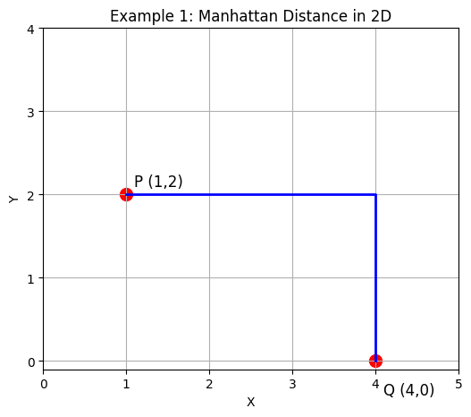

# K-Nearest Neighbors (KNN)

## 1. The Concept
KNN is one of the simplest and most intuitive algorithms. It is a **Non-Parametric**, **Lazy Learning** algorithm.

* **"Lazy Learning":** It doesn't actually "learn" or build a model during the training phase. It just memorizes the training dataset. It only acts when you ask for a prediction.
* **"Birds of a feather flock together":** To predict a new data point, KNN looks at the 'K' closest data points around it and takes a vote.

### How it works
1.  **Select K:** Choose the number of neighbors (e.g., K=5).
2.  **Calculate Distance:** Find the distance between the new point and all training points.
3.  **Find Neighbors:** Pick the K closest points.
4.  **Vote:**
    * **Classification:** Return the most frequent class.
    * **Regression:** Return the average value.

## 2. The Math (Distance Metrics)
How do we measure "closeness"?

### Euclidean Distance (Most Common)
The straight-line distance between two points $(x_1, y_1)$ and $(x_2, y_2)$.
$$d = \sqrt{(x_2 - x_1)^2 + (y_2 - y_1)^2}$$

### Manhattan Distance (Taxicab Geometry or L1)
The distance if you could only move along a grid (like city blocks)
measures how far apart two points are by summing the absolute differences of their coordinates. Unlike straight-line (Euclidean) distance, it calculates distance along grid-like paths like a taxi navigating city streets rather than cutting through buildings.

$$d = |x_2 - x_1| + |y_2 - y_1|$$

## 3. Critical Requirement: Feature Scaling
**⚠️ Important:** Because KNN calculates distance, it is highly sensitive to the scale of data.
* If Feature A ranges from 0-1 (small) and Feature B ranges from 0-1000 (large), Feature B will dominate the distance calculation.
* **Solution:** You MUST use `StandardScaler` or `MinMaxScaler` before using KNN.

## 4. Resources
### 📖 Documentation
* [Scikit-Learn: Nearest Neighbors](https://scikit-learn.org/stable/modules/neighbors.html)

### 📺 Videos
* [StatQuest: K-Nearest Neighbors](https://www.youtube.com/watch?v=HVXime0nQeI)