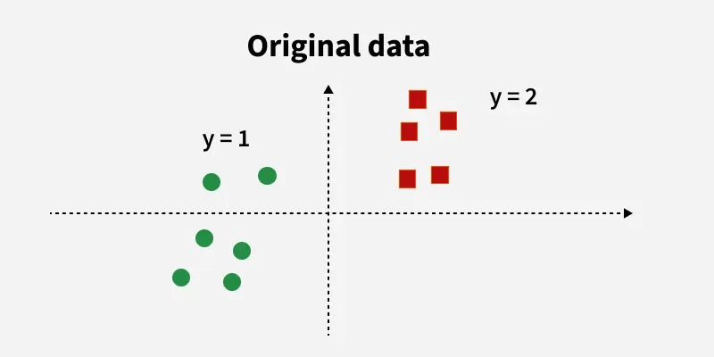
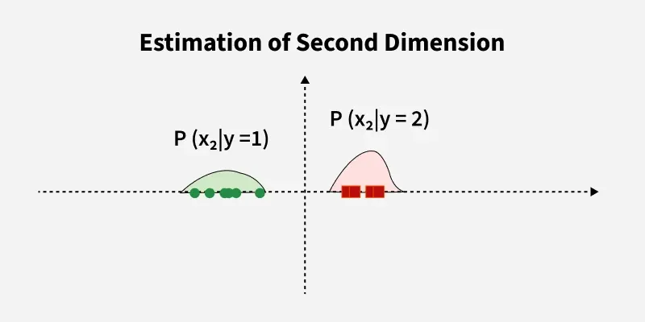
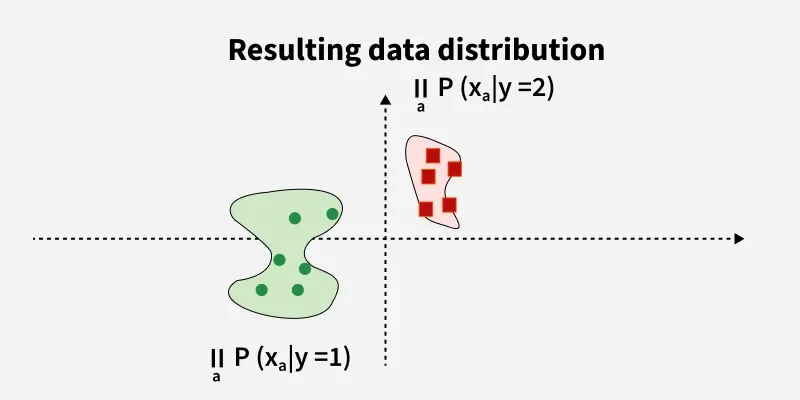

# Naive Bayes Classifier

## 1. The Concept
Naive Bayes is a probabilistic classifier based on **Bayes' Theorem**. It predicts the probability that a given data point belongs to a particular class.

### Why is it called "Naive"?
It assumes that all features in the dataset are **mutually independent**.
* *Example:* It assumes that the presence of the word "Money" in an email has nothing to do with the word "Free."
* In reality, this is rarely true (words are often linked), but the algorithm still performs surprisingly well!

## 2. The Math (Bayes' Theorem)
The core formula calculates the **Posterior Probability**:

$$P(A|B) = \frac{P(B|A) \cdot P(A)}{P(B)}$$

Where:
* **$P(A|B)$ (Posterior):** Probability of Class A given Feature B (What we want to find).
* **$P(B|A)$ (Likelihood):** Probability of Feature B appearing in Class A.
* **$P(A)$ (Prior):** The initial probability of Class A being true (before seeing data).
* **$P(B)$ (Evidence):** The total probability of Feature B occurring.

## 3. Types of Naive Bayes
1.  **Gaussian Naive Bayes:** Used when features are continuous numbers following a normal distribution (e.g., Iris dataset).
2.  **Multinomial Naive Bayes:** Used for discrete counts (e.g., **Text Classification**, word counts).
3.  **Bernoulli Naive Bayes:** Used for binary/boolean features (e.g., Yes/No, True/False).

## 4. Resources
### 📖 Documentation
* [Scikit-Learn: Naive Bayes](https://scikit-learn.org/stable/modules/naive_bayes.html)

### 📺 Videos
* [StatQuest: Naive Bayes Clearly Explained](https://www.youtube.com/watch?v=O2L2Uv9pdDA)
* [Spam Filter Logic with Naive Bayes](https://www.youtube.com/watch?v=EGsE8CqAtio)