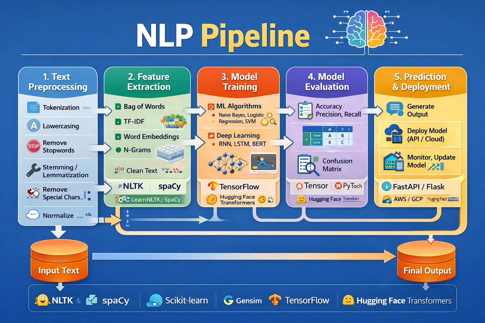

# NLP (Natural Language Processing)

## Defination
It is a subfield of linguistics CS and AI concerned with the interactions between computers & human language in particular how to program computers to process & analyze large amounts of natural language data.

## Real World Applications
1. Contextual Advertisements
2. Email clients - spam filtering , smart reply
3. Social Media - removing adult content
4. search engines
5. Chat bots

## Common NLP tasks
1. Text/Document Classifier 
2. Sentiment Analysis 
3. Information Retrieval 
4. Parts of speech tagging 
5. Language detection & machine translation 
6. Conversational Agents - 
    *  **Text based** 
    * **speech based**
7. Knowledge graph & QA systems
8. Text summarization
9. Topic Modeling
10. Text generation
11. Spell Checking & Grammer 
12. Text Parsing
13. Speech to text

## Approaches to NLP

* Heuristic Methods
* ML Based Methods
* DL Based Methods

#### Heuristic Approaches
   * Regular Expressions
   * Wordnet
   * Open mind common sense

*Advantages :-* Faster Problem Solving , current scenario 

#### ML Approaches
   * ML workflow
   * Algorithm Used
     * Naive bayes
     * Logistic Reg.
     * SVM 
     * LDA

*Advantages :-* Learns automatically from data ,More accurate than rule-based methods 

#### DL Approaches
   * Architecture Used
     * RNN
     * LSTM
     * GRU/CNN
     * Transformers
     * Autoencoders

*Advantages:-* High accuracy,Handles complex tasks easily,No need for manual feature engineering

### Challenges in NLP
1. Ambiguity
2. Contextual words
3. Colloquialisms & slang
4. Synonyms
5. Spelling errors
6. Irony, sarcasm , tonal difference
7. Creativity
8. Diversity

